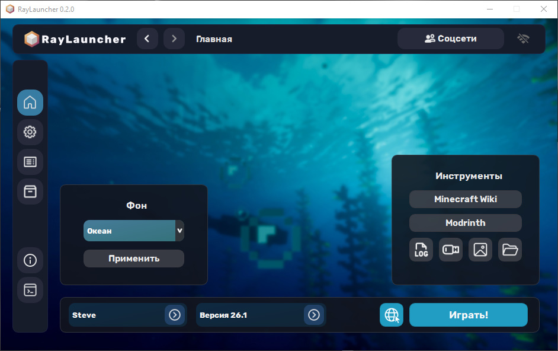
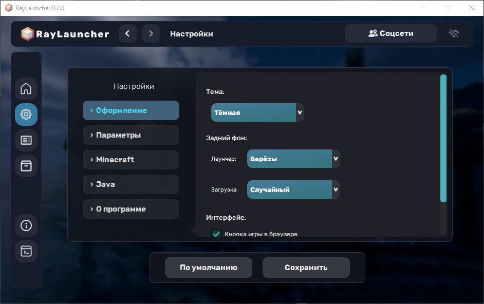
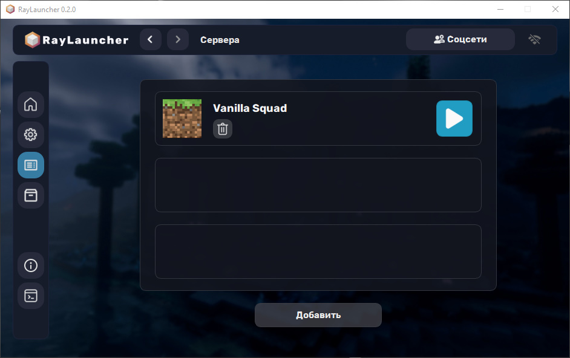

# 🚀 RayLauncher

<b>RayLauncher — ваш новый проводник в мир Minecraft!</b>

<i>Почувствуй скорость! Этот лаунчер оптимизирован для максимальной производительности, весит примерно 100 МБ и практически мало использует CPU.</i>

---

## 💎 **Скриншоты**

---

## 📍 **Установка**
1. Скачайте последнюю версию со страницы **[Releases](https://github.com/vibeOptimist/RayLauncher/releases)**.
2. Запустите интсталятор (от имени администратора, если требуется).
3. Следуйте инструкциям мастера установки.

---

## ⚙️ **Системные требования**
   Компонент       | Требования                    |
 |-----------------|-------------------------------|
 | ОС              | Windows 8/10/11 (64-bit)      |
 | ОЗУ             | Минимум       2 ГБ            |
 | Java            | Устанавливается автоматически |

---

## ⚠️ **Возможные проблемы**
 | Проблема                          | Решение                                                                             |
 |-----------------------------------|-------------------------------------------------------------------------------------|
 | Ошибка запуска                    | Установите [Microsoft Visual C++](https://aka.ms/vs/17/release/vc_redist.x64.exe)   |
 | Антивирус блокирует файл          | Добавьте `RayLauncher.exe` в исключения антивируса                                  |

---

## 📄 **Лицензия**
Используя данное ПО, вы соглашаетесь с **[EULA](LICENSE.txt)**.

---

## 🤝 **Поддержка**
- **Telegram автора**: [@vibeOptimist](https://t.me/vibeOptimist)
- **Канал проекта**: [@raylauncher](https://t.me/raylauncher)

